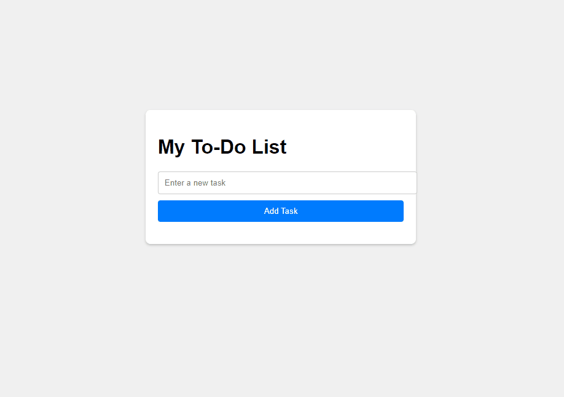

 
## TO DO LIST APPLICATION
### overview  
- To-Do List application allows users to add, display, and remove tasks.  

- The application saves tasks in local storage, ensuring data persistence across sessions.  

- The application is developed using the following technologies;
    - HMTL
    - CSS
    - Vanilla Javascript

### Form Usage
- Go to dynamic-to-do-list-js repo.
- Find the code button and click on it to copy the link.
- Copy the link and use git clone [url] in your terminal to own it.
- Run the index file in the repo to view the application in the browser and interact with it.